# 2_TIL_Private

:purple_heart: Java

:green_heart: Vue.js

:black_heart: Javascript

:two_hearts: Android 안드로이드

:handshake: PJT업무

:crescent_moon: 달이 조언​

:heart: 개념/용어

:blue_heart: 글/영상

:books: 책

> :orange_book: 코드로 배우는 스프링 웹 프로젝트 개정판 (2019.07, 구멍가게코딩단 지음)
>
> :closed_book: 마이바티스를 사용한 자바 퍼시스턴스 개발 (2013.08, 시바 프라사드 레디 지음/이동국 옮김)


## 02/01(월)

:purple_heart: Java

자바 개발환경 https://soolper.tistory.com/6

- **DBeaver** 설치 (통합DB관리 tool )

  > https://dbeaver.io/download/
  >
  > 단축키 정리 사이트 : https://defkey.com/dbeaver-shortcuts
  >
  > 디비버 깃헙 위키 : https://github.com/dbeaver/dbeaver/wiki

- **mysql** 설치 (현재: MySQL Installer 8.0.23) 로컬호스트 사용

  > https://dev.mysql.com/downloads/mysql/
  >
  > 설치참고 https://m.blog.naver.com/bjh7007/221829548634

:handshake: PJT개인 서버 만들기

- VSCODE 로 스프링부트 프로젝트 초기설정 

  > 설정 참고 [VS-Code-Spring-Boot-프로젝트-생성하기](https://leeborn.tistory.com/entry/VS-Code-Spring-Boot-%ED%94%84%EB%A1%9C%EC%A0%9D%ED%8A%B8-%EC%83%9D%EC%84%B1%ED%95%98%EA%B8%B0)


## 02/02(화)

:purple_heart: Java

- DBeaver - 로컬호스트3306 

  - public key retrieval is not allowed 에러 (mysql 8버전이상 GUI 이슈) 

    > 해결참고 https://earth-95.tistory.com/52 / https://deviscreen.tistory.com/85 

  - 우클릭 F4 edit Connection

  - ```
    jdbc:mysql://localhost:3306/dev-product?useUnicode=true&characterEncoding=utf8&allowPublicKeyRetrieval=true&useSSL=false
    ```
    
  - General >Security Read-only 로 건들면 안되는 DB 잠금

- maven 리포지토리 pom.xml

  > https://mvnrepository.com/

:handshake: PJT개인 서버 만들기

- 디비버에 유저 / 게시판 DB테이블 임시 생성
  - MySQL 데이터 타입과 Java 데이터 타입 비교/매칭
- application.properties 에 mysql경로와 mybatis설정 등 추가

:house:

- 테이블 EDIT 임시
- MVC 패턴으로 전체 조회하기
  - `resources/mybatis/*Mapper.xml ` 에 매퍼SQL문 두기


## 02/03(수)

:purple_heart: Java

- ##### 마이바티스

  > 마이바티스 한글판 공식문서 https://mybatis.org/mybatis-3/ko/index.html
  >
  > :closed_book: 마이바티스를 사용한 자바 퍼시스턴스 개발 (2013.08, 시바 프라사드 레디 지음/이동국 옮김)
  >
  > p70~80

:handshake: PJT개인 서버 만들기

- 로그인

- 테이블 EDIT 완료

- `data/dto` 폴더와 `data/model` 폴더에 모델 두기 

- 페이지네이션 LIMIT / OFFSET = = pageSize / page

  - http://localhost:8080/board-items?pageSize=1&page=1

- 데이터 이름 문제

  - 데이터베이스에는 snake_case를, Java 코드에서는 carmelCase로설정을 하였기에 이름이 일치하지 않아 데이터를 제대로 가져오지 못하는 문제가 발생

    : snake_case(diary_date)를 carmelCase(diaryDate)로 변경


## 02/04(목)

:purple_heart: Java

- ##### 마이바티스

  > v3.5.6 / 2020.10.07
  >
  > 마이바티스 영문판공식문서 https://mybatis.org/mybatis-3/index.html 
  >
  > 마이바티스 한글판 공식문서 https://mybatis.org/mybatis-3/ko/index.html
  >
  > :closed_book: 마이바티스를 사용한 자바 퍼시스턴스 개발 (2013.08, 시바 프라사드 레디 지음/이동국 옮김)
  >

:handshake: PJT개인 서버 만들기

- CRUD

  > 참고 https://mybatis.org/mybatis-3/ko/sqlmap-xml.html#insert_update_and_delete
  >
  > [IntelliJSpringGradleMyBatismySql-게시판만들기](https://velog.io/@hanblueblue/series/IntelliJSpringGradleMyBatismySql-%EA%B2%8C%EC%8B%9C%ED%8C%90%EB%A7%8C%EB%93%A4%EA%B8%B0)
  >
  >  [프로젝트2-myBatis-설정](https://velog.io/@hanblueblue/%ED%94%84%EB%A1%9C%EC%A0%9D%ED%8A%B82-myBatis-%EC%84%A4%EC%A0%95) #4-crud-작성-후-테스트-수행하기

- ```
  Spring 4.3 버전에 추가된 내용으로는 기존의 @RequestMapping(value = "/", method="...")의 어노테이션의 사용을 조금 더 명시적고 효율적인 방법으로 사용하기 위해 @GetMapping, @PostMapping, DeleteMapping, @PutMapping, @PatchMapping의 메소드
  
  출처: https://toma0912.tistory.com/86 [토마의 개발노트]
  ```

- ```bash
  마이바티스DB에 없는 외래키값은 차단 0ㅇ0
  ### Error updating database.  Cause: java.sql.SQLIntegrityConstraintViolationException: Cannot add or update a child row: a foreign key constraint fails (`tododb`.`boarditem`, CONSTRAINT `todoboard_FK` FOREIGN KEY (`userId`) REFERENCES `user` (`id`) ON DELETE CASCADE ON UPDATE CASCADE)
  
  ### SQL: INSERT INTO boarditem (title, content, createdAt, updatedAt, userId)          VALUE (?, ?, NOW(), NOW(), ?);
  ### Cause: java.sql.SQLIntegrityConstraintViolationException: Cannot add or update a child row: a foreign key constraint fails (`tododb`.`boarditem`, CONSTRAINT `todoboard_FK` FOREIGN KEY (`userId`) REFERENCES `user` 
  (`id`) ON DELETE CASCADE ON UPDATE CASCADE)
  ```

- 외래키 / 조인 없이 고민

:house:

- 서버 : 한 개 조회는 [] 배열보다 {} 객체 한개
- 역정규화
- SpringBoot와 Vuex 연동 - 로그인 세션 


## 02/05(금)

:purple_heart: Java

:handshake: PJT개인 서버 만들기

- 서버 : 로그인한 유저에 해당되는 CRUD 

- 로그인 세션 처리

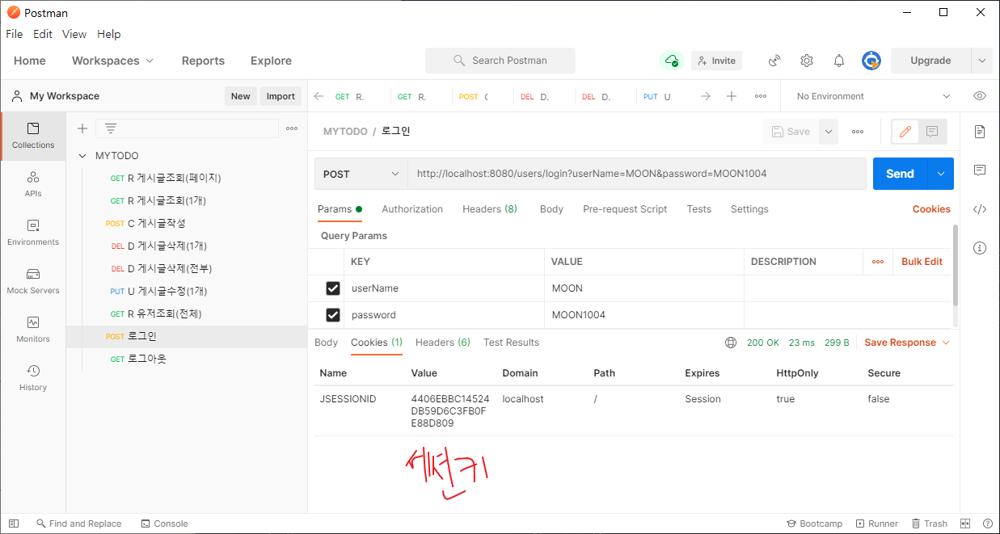

- SpringBoot와 Vuex 연동

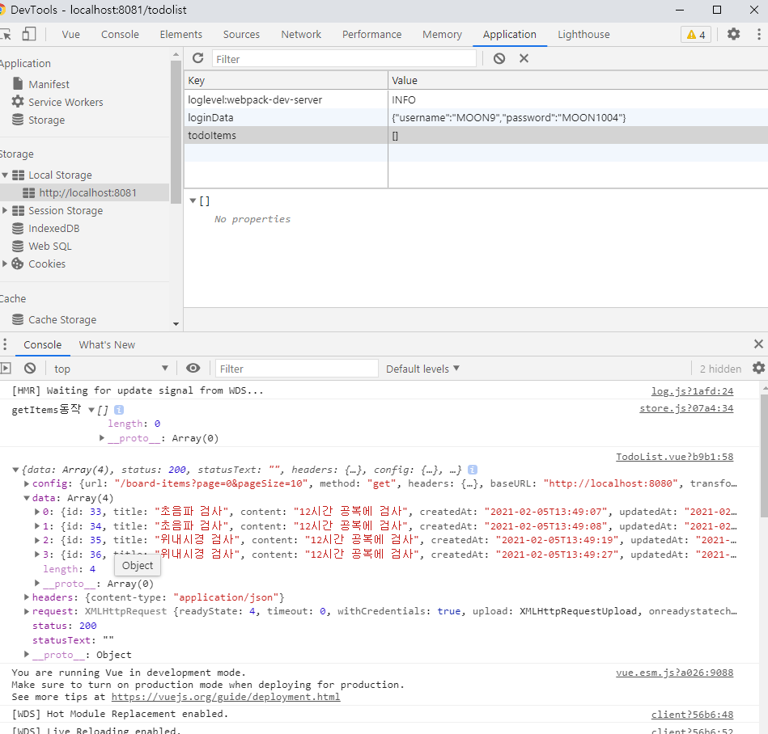


## 02/06(토)

:purple_heart: Java

:handshake: PJT개인 서버 만들기

- 로그인 세션 유지
- 페이지네이션을 위한 range : 총 페이지 갯수 추가하여 api

:house:

- JSP & Servlet

  > 자세한 문서 http://www.devkuma.com/books/pages/1190

  - HttpServletRequest : 클라이언트의 요청받은 정보
  - HttpServletResponse : 클라이언트의 응답보낼 정보( ex 파일전송)


## 02/07(일)

 :green_heart: Vuex

:handshake: PJT개인 서버 만들기(END)

- navbar 디자인수정


## 02/09(화)

 :green_heart: Vuex

- #### Account 관련 vuex 소스 보기(+휴대폰인증)

- https://kr.vuejs.org/v2/guide/components-registration.html

  - 컴포넌트 사용하기
  - 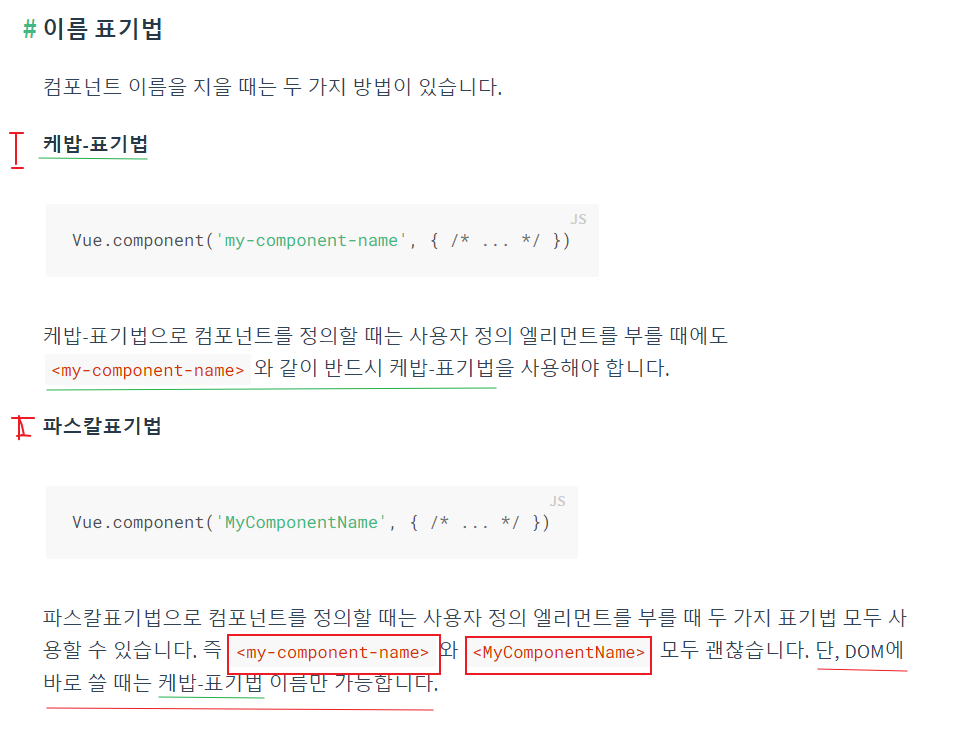

  - ```
    ES2015 이상에서는 객체 내의 components 옵션에서,
    ComponentA: ComponentA라고 하지 않고 ComponentA라고만 해도 됩니다.
    즉 키로 아래의 두 가지가 모두 가능합니다.
    (역자 주: component-a: ComponentA, ComponentA: ComponentA, ComponentA가 모두 가능
    ```


##### :bookmark: 추가 학습 필요

- 일반 로그인 / 소셜 로그인 

- 정규식 regex


## 02/11(목) :house:

:purple_heart: Java

- Spring의 Mybatis

  - [Mapper와 DAO 차이점](https://twofootdog.github.io/Spring-DAO%EC%99%80-Mapper%EC%9D%98-%EC%B0%A8%EC%9D%B4%EC%A0%90/)

  - SqlSessionFactory 빌드하고 sqlSession 만들기는 spring 에서는 자동이다.

  - ```xml
    <?xml version="1.0" encoding="UTF-8" ?>
    <!DOCTYPE mapper
      PUBLIC "-//mybatis.org//DTD Mapper 3.0//EN"
      "http://mybatis.org/dtd/mybatis-3-mapper.dtd">
    <mapper namespace="com.mytodo.todo.repository.UserMapper">
      <select id="findAll" resultType="com.mytodo.todo.data.model.User">
        select * from user; 
      </select>
    </mapper>
    ```

  - [crud mapper](https://atoz-develop.tistory.com/entry/MyBatis-%EC%84%A4%EC%A0%95-%ED%8C%8C%EC%9D%BC-SQL-Mapper-%EC%9E%91%EC%84%B1-%EB%B0%A9%EB%B2%95)

    - | 속성              | 설명                                                         |
      | ----------------- | ------------------------------------------------------------ |
      | **id**            | 각 SQL문을 구분                                              |
      | **resultType**    | SELECT문 실행 결과를 담을 객체<br/>패키지 이름을 포함한 클래스 이름 또는 객체 alias 지정 |
      | **resultMap**     | SELECT문 실행 결과를 담을 객체를 resultMap으로 지정<br/><resultMap>을 따로 선언해줘야 한다.<br/>resultType과 resultMap 중 하나를 택해서 설정한다. |
      | **parameterType** | 이 속성에 지정한 객체의 프로퍼티값이 SQL문의 입력 파라미터에 지정된다. |

  - POST요청에 있던 415 Error (Body에 JSON으로 해줘야하는데 Param으로 넣으려고 하니 Content Type Err ;;;)

    - @RequestParam : form-data 에 키 벨류 넣어주기
    - @RequestBody : Body에 JSON으로 해주기 
    - https://lkhlkh23.tistory.com/88

:handshake: PJT개인 AGAIN - Todo Back  1일차


## 02/12(금) :house:

:purple_heart: Java

- JSP & Servlet

  > 자세한 문서 http://www.devkuma.com/books/pages/1190

  - ##### `HttpServletRequest` : 클라이언트의 요청받은 정보

    - getSession : 반환한다. 요청에 관련된 현재 세션을 반환하고 (true)없으면 세션을 만들기

    - ```java
          HttpServletRequest.class
      	/**
           * Returns the current <code>HttpSession</code> associated with this request
           * or, if there is no current session and <code>create</code> is true,
           * returns a new session.
           * <p>
           * If <code>create</code> is <code>false</code> and the request has no valid
           * <code>HttpSession</code>, this method returns <code>null</code>.
           * <p>
           * To make sure the session is properly maintained, you must call this
           * method before the response is committed. If the container is using
           * cookies to maintain session integrity and is asked to create a new
           * session when the response is committed, an IllegalStateException is
           * thrown.
           *
           * @param create
           *            <code>true</code> to create a new session for this request if
           *            necessary; <code>false</code> to return <code>null</code> if
           *            there's no current session
           * @return the <code>HttpSession</code> associated with this request or
           *         <code>null</code> if <code>create</code> is <code>false</code>
           *         and the request has no valid session
           * @see #getSession()
           */
          public HttpSession getSession(boolean create);
      
          /**
           * Returns the current session associated with this request, or if the
           * request does not have a session, creates one.
           *
           * @return the <code>HttpSession</code> associated with this request
           * @see #getSession(boolean)
           */
          public HttpSession getSession();
      ```

    - getAttribute, setAttribute

  - ##### `HttpServletResponse` : 클라이언트의 응답보낼 정보( ex 파일전송)

- ##### 마이바티스 CRUD

  > https://mybatis.org/mybatis-3/ko/sqlmap-xml.html


:handshake: PJT개인 AGAIN - Todo Back  2일차

- ##### 로그인 관련 : HttpSesssion

  - 서버에서 세션(임시저장소)를 만들어서, 브라우저는 세션키를 저장하여, 다음 요청마다 같이 들고 온다. 
  - 방법1 : setCookie (쿠키(키:Cookie)에 저장하면 자동으로 같이 요청한다.) / 로컬스토리지 (키이름도 지정해주고 요청여부 선택)
  - 방법2: Header or 내용 (config)
  - Redis, DB, File

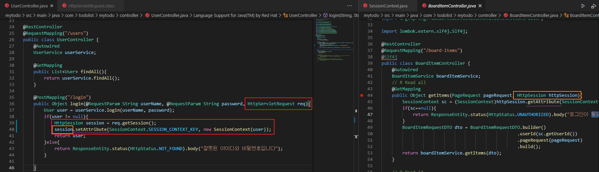


:handshake: PJT개인 AGAIN - Todo Front 1일차

:green_heart: Vuex

> 캡틴판교 블로그 https://joshua1988.github.io/
>
> Vue CLI 설치 및 사용 방법 https://nangko.tistory.com/13
>
> 뷰라우터 https://router.vuejs.org/kr/
>
> 뷰티파이 https://v2.vuetifyjs.com/ko/getting-started/quick-start/
>
> 뷰액시오스 https://joshua1988.github.io/vue-camp/vue/axios.html

- Vue CLI 3.x버전이 설치 된 경우 Vue CLI 2.x 버전의 설정 방식으로 사용하고자 하는 경우 @vue/cli-init 을 글로벌로 설치하면 사용할 수 있다.

- ```
  npm install -g @vue/cli-init
  ```

- ```bash
  $ npm install vue-router
  $ npm install vuetify
  ```

- v2.4.4  : https://vuetifyjs.com/en/getting-started/installation/#vue-cli-install

  - ```
    The current version of Vuetify does not support Vue 3. Support for Vue 3 will come with the release of Vuetify v3. When creating a new project, please ensure you selected Vue 2 from the Vue CLI prompts, or that you are installing to an existing Vue 2 project.
    
    현재 버전의 Vuetify는 Vue 3을 지원하지 않습니다. Vue 3에 대한 지원은 Vuetify v3 릴리스와 함께 제공됩니다. 새 프로젝트를 만들 때 Vue CLI 프롬프트에서 Vue 2를 선택했거나 기존 Vue 2 프로젝트에 설치하고 있는지 확인하십시오.
    ```

- post의 @RequestBody 일 경우 JSON {} , @RequestParms 일 경우 querystring.stringify({title, content})


## 02/13(토) :house:

:handshake: PJT개인 AGAIN - Todo Front 2일차

:green_heart: Vuex

- 뷰에서 권고하는 HTTP 통신 라이브러리는 액시오스(Axios)입니다.
   Promise 기반의 HTTP 통신 라이브러리이며
  상대적으로 다른 HTTP 통신 라이브러리들에 비해 문서화가 잘되어 있고 API가 다양

#### CORS (CrossOrigin)

> https://kshman94.tistory.com/118

- java 해결법 2단계

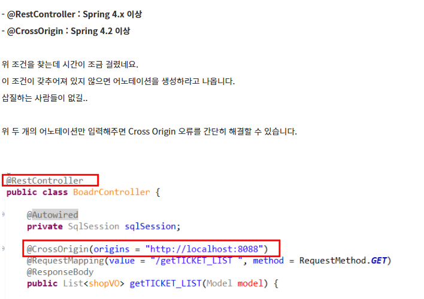

- java 해결법 2단계 ★★★

```java
// 모든 요청 메서드마다 @CrossOrigin(origins = "http://localhost:8081") 하지 않고
//C:\Users\Desktop\MyTodo\mytodo_java\mytodo\src\main\java\com\todolist\mytodo\config\WebMVCConfig.java
// 광역 해결
package com.todolist.mytodo.config;

import org.springframework.context.annotation.Configuration;
import org.springframework.web.servlet.config.annotation.CorsRegistry;
import org.springframework.web.servlet.config.annotation.WebMvcConfigurer;

@Configuration
public class WebMVCConfig implements WebMvcConfigurer {

    @Override
    public void addCorsMappings(CorsRegistry registry) {
        registry.addMapping("/**")
            .allowCredentials(true)
            .allowedOrigins("http://localhost:8081")
            .allowedMethods("HEAD", "GET", "PUT", "POST", "DELETE", "PATCH");
	}
}
```


- vue 해결법 1단계

```js
Vue.js
import axios from 'axios'
      axios.post('http://localhost:8080/users/login',{userName, password})
        .then(function(response) {
          console.log("성공",response);
        })
        .catch(function(error) {
          console.log("실패",error);
        });
```

- 쿠키는?

- axios 는 기본적으로 서버의 브라우저 setCookie 를 무시하니 조치가 필요

  > https://www.npmjs.com/package/axios-cookiejar-support axios-cookiejar-support 와 tough-cookie 는 세트

  - ```bash
    $ npm i axios tough-cookie axios-cookiejar-support
    ```

  - ```js
    Usage
    const axios = require('axios').default;
    const axiosCookieJarSupport = require('axios-cookiejar-support').default;
    const tough = require('tough-cookie');
     
    axiosCookieJarSupport(axios);
     
    const cookieJar = new tough.CookieJar();
     
    axios
      .get('https://google.com', {
        jar: cookieJar, // tough.CookieJar or boolean
        withCredentials: true, // If true, send cookie stored in jar
      })
      .then(() => {
        console.log(cookieJar);
      });
    ```

- vue 해결법 2단계 ★★★

```js
//C:\Users\송다혜\Desktop\MyTodo\mytodo_vuex_axios\src\api\index.js
import axios from 'axios'
import {default as axiosCookieJarSupport} from 'axios-cookiejar-support';
import  * as tough from 'tough-cookie';

axiosCookieJarSupport(axios);
 
const cookieJar = new tough.CookieJar();

export default axios.create({
  baseURL: "http://localhost:8080",
  jar: cookieJar, // tough.CookieJar or boolean
  withCredentials: true, // If true, send cookie stored in jar
})
```

- axios 로 API  요청 응답 가능

---

주의 :star:

- ```js
          .then(function(response) {
            console.log("로그인 성공",response);
          })
  ```

- ```js
            .then(response => {
              console.log("목록",response.data);
              this.itemlist = response.data;
              console.log(this.itemlist)
            })
  ```

- this를 사용하기 위해서는 화살표함수!

---


## 02/16(화)

:green_heart: Vuex

:blue_heart:  Tortoise SVN 가이드

https://openbee.kr/250#_Toc99303583

https://dzzienki.tistory.com/46?category=1031882 


## 02/17(수)

:green_heart: Vuex

- 라이브러리
  - Vee-Validate (validation 관련)

    > [Vee-Validate 라이브러리 사용법](https://velog.io/@pear/Vee-Validate-%EB%9D%BC%EC%9D%B4%EB%B8%8C%EB%9F%AC%EB%A6%AC-%EC%82%AC%EC%9A%A9%EB%B2%95)
    >
    > v2 https://vee-validate.logaretm.com/v2
    >
    > v3  / Vue2
    >
    > v4 / Vue3 (최신)
  
  - vue-the-mask (input mask)
  
    > https://vuejs-tips.github.io/vue-the-mask/


:blue_heart:  카카오소셜가이드

> https://developers.kakao.com/docs/latest/ko/getting-started/sdk-android-v1#key-hash

개발 모드에서는 키해시등록 필요


## 02/18(목)

:green_heart: Vuex

- 이번 달 목표
  - 모던자바스크립트 끝내기 / vue 공식 문서 (vuex, vue.js2, vue router)
  - 안드로이드 구조 파악하기
  - 그날 그날 한 것 / 알아야 하는 것 확인/묻고/해결하고 자기

- watch / computed

  > [watch와 computed](https://jeongwooahn.medium.com/vue-js-watch%EC%99%80-computed-%EC%9D%98-%EC%B0%A8%EC%9D%B4%EC%99%80-%EC%82%AC%EC%9A%A9%EB%B2%95-e2edce37ec34)

  `computed` https://kr.vuejs.org/v2/guide/computed.html

  - `methods` 에만 함수를 선언를 하지 않고, 특정 경우에 따라 함수를 다른 속성에 선언한다.
  - 1 데이터를 건들지 않고(Create, Update, Delete ), Read 조회만 하고 싶을 때 !!!(연산)
    - {{ accounts[0] }} 방식이 아닌, 특정조건을 걸어서 필터링해서 조회 할 때
    - 값을 리턴
    - computed 내의 함수의 이름은 `명사`형태
  - 2 캐싱과 메소드

  - computed 와 methods 와 watch 속성의 비교
    - computed : 내장 API활용 간단한 연산 정도, 대상 데이터 값 변경되면 자동으로 수행 능동적 갱신
    - watch: 데이터 호출 같이 시간이 더 많이 소모되는 비동기 처리 적합
    - methods : 호출 할때마다 해당 로직 수행 수동적 갱신

- store 여러개 일 때 (.. 생략.. )

- https://htmlcolorcodes.com/


## 02/19(금)

:green_heart: Vuex

```js
debugger;
```

콘솔로그를 걸어서 클릭하는 것보다 debugger;를 코드 내부에 작성하면 브라우저에서 디버그가 편리

https://vuejs-kr.github.io/vue/vee-validate/2017/04/01/using-vee-validate/

Account Vuex 프론트 단 구조 분석  (.. 생략.. )

:speech_balloon:

- @submit.prevent vue.js 
  - form 제출시 새로고침 방지 / 제출 이벤트가 페이지를 다시 로드 하지 않습니다 
  - https://kr.vuejs.org/v2/guide/events.html 
  - https://ggmouse.tistory.com/98

- html5 | input태그의 요소값 검사 pattern []
  - http://tcpschool.com/html-tag-attrs/input-pattern


## 02/21(일) :house:

:purple_heart: Java

- 스프링스큐리티

  > 공식문서 https://docs.spring.io/spring-security/site/docs/current/reference/html5/#servlet-hello
  >
  > 참고
  >
  > https://coding-start.tistory.com/153
  >
  > https://devuna.tistory.com/55

:green_heart: Vuex

- 이벤트 버스

  > https://kdinner.tistory.com/53
  >
  > https://vuejs-kr.github.io/jekyll/update/2017/02/13/vuejs-eventbus/
  >
  > https://webruden.tistory.com/109

- 오류처리 https://xn--xy1bk56a.run/axios/guide/error-handling.html

:black_heart: Javascript : synchronous 씽크로노스 동기(순서대로 작동)

**async비동기(에이씽크로노스)** / 언제 코드가 실행 될 지 예측할 수 없음

**1 callback , 2 promise, 3 async await**

### 1 callback

https://ko.javascript.info/callbacks

https://youtu.be/s1vpVCrT8f4 [드림코딩 by 엘리](https://www.youtube.com/channel/UC_4u-bXaba7yrRz_6x6kb_w)

- callback(내 함수 코드를 실행해)  : 동기콜백, 비동기콜백

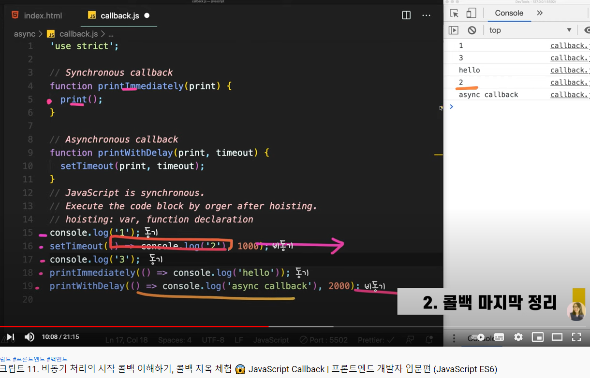

### 2 promise

비동기를 간편하게 사용하는 JS 오브젝트 , 성공, 에러

ex 언제 답장이 올지 모르는 메일을 보내고 기다리기, 네트워크 통신, 파일 읽기...

1) State : pending --> fulfilled or rejected 

2) Producer 제공자 / 소비자 Consumer

- 2-1) Promise 객체 생성

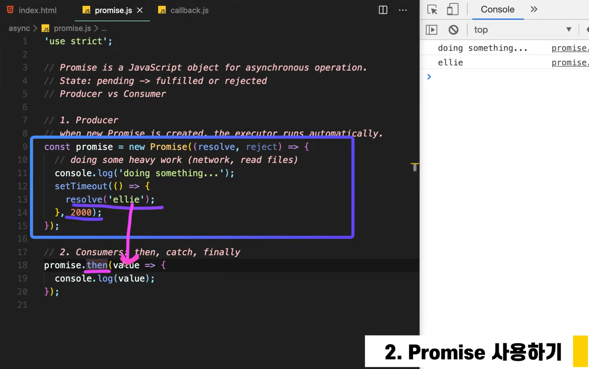

- 2-2) Promise 인스턴스 사용

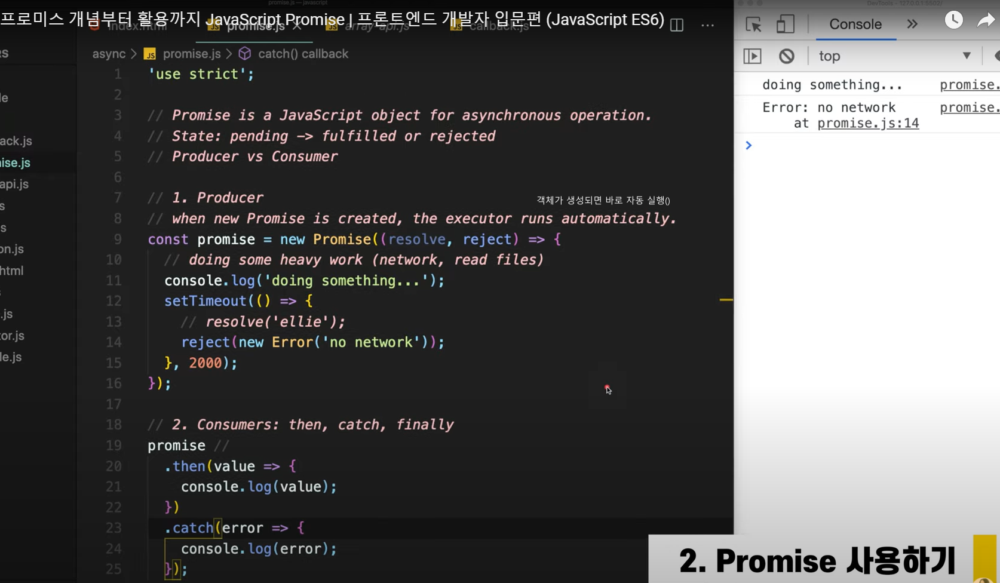

- 2-3) 프로미스 체이닝

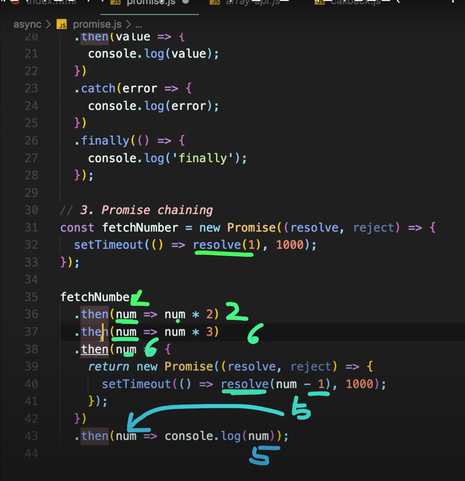

- 2-4) Error Handling

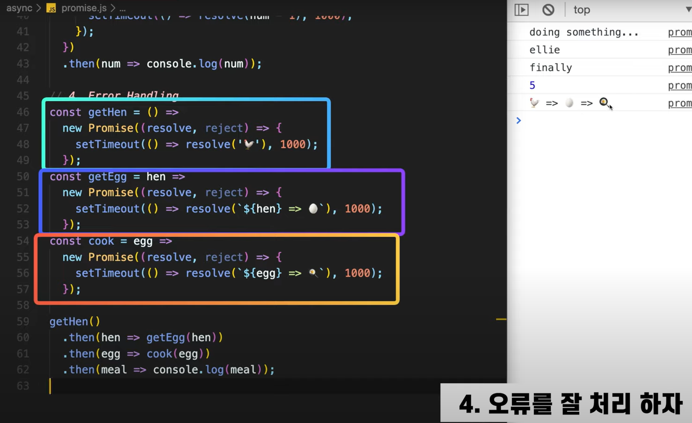

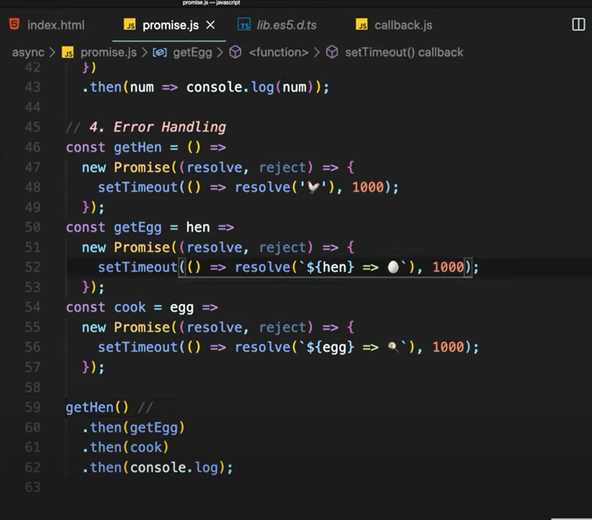

인자가 하나면 생략가능

오류처리

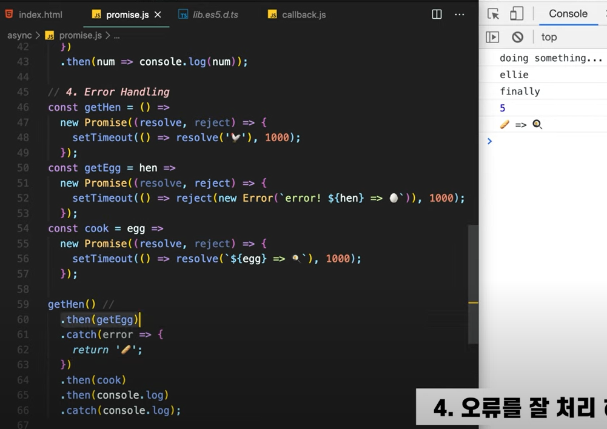

- 2-5 ) 콜백 지옥 > promise로 변경

  - 前

    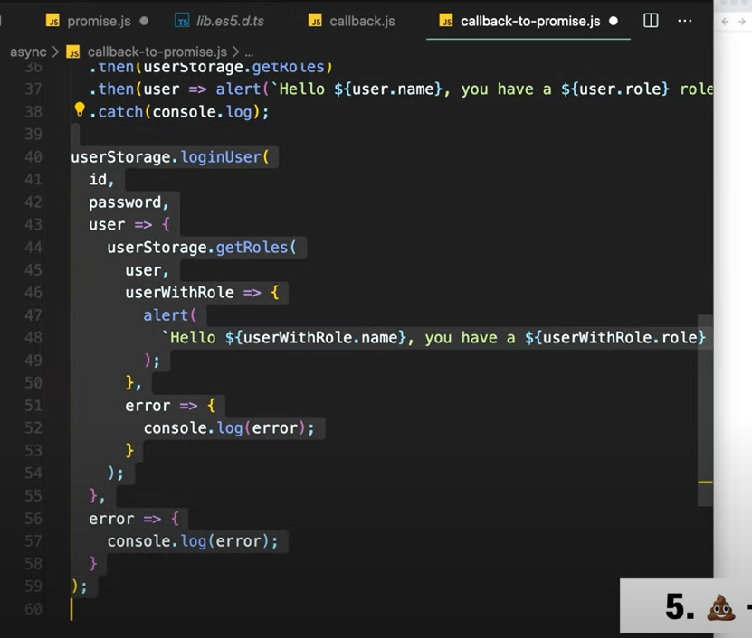

  - 後

    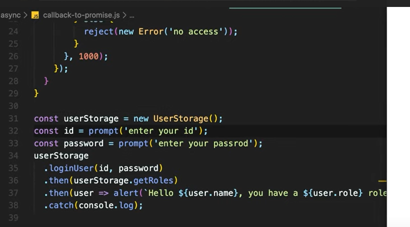


## 02/23(화)

$ git clone -b 브랜치명 --single-branch 주소명 [git에서-특정-브랜치만-clone하는-방법](https://velog.io/@yhe228/git%EC%97%90%EC%84%9C-%ED%8A%B9%EC%A0%95-%EB%B8%8C%EB%9E%9C%EC%B9%98%EB%A7%8C-clone%ED%95%98%EB%8A%94-%EB%B0%A9%EB%B2%95)


## 02/24(수) :two_hearts:

:two_hearts: Android

`android main ui thread `

- 프로세스와 스레드가 Android 애플리케이션에서 작동하는 방식

> https://developer.android.com/guide/components/processes-and-threads?hl=ko

- Context

> https://arabiannight.tistory.com/284
>
> https://shinjekim.github.io/android/2019/11/01/Android-context%EB%9E%80/
>
> 개는 동물이다. Activity는 Context이다 (역은 성립하지 않지!)

- 권한설정(카메라, 위치, 저장공간 ... ) Permissions

> ANDROID PERMISSION CHECK GITHUB
>
> https://github.com/nabinbhandari/Android-Permissions
>
> https://github.com/Karumi/Dexter

- Memory Leak ( 메모리 누수 ) 

> https://dlucky.tistory.com/212 WeakReference / context = null

- onCancelled

> https://developer.android.com/reference/android/os/AsyncTask#onCancelled(Result)

- org.json

> json 파싱 라이브러리
>
> https://codechacha.com/ko/java-parse-json/

- asynctask get context


## 02/25(목)

:two_hearts: Android

- Toast 하단의 알림창

- 안드로이드 디버그

  chrome://inspect/#devices

- Context

  - ```
    어플리케이션 환경에 관한 글로벌 정보를 접근하기 위한 인터페이스.
    Abstract 클래스이며 실재 구현은 안드로이드 시스템에 의해 제공된다.
    Context 를 통해, 어플리케이션에 특화된 리소스나 클래스에 접근할 수 있을 뿐만 아니라,
    추가적으로, 어플리케이션 레벨의 작업
    - Activity 실행, Intent 브로드캐스팅, Intent 수신 등, 을 수행하기 위한 API 를 호출 할 수도 있다.
    안드로이드 개발자 사이트 오버뷰 / 출처: https://arabiannight.tistory.com/284
    ```

  - 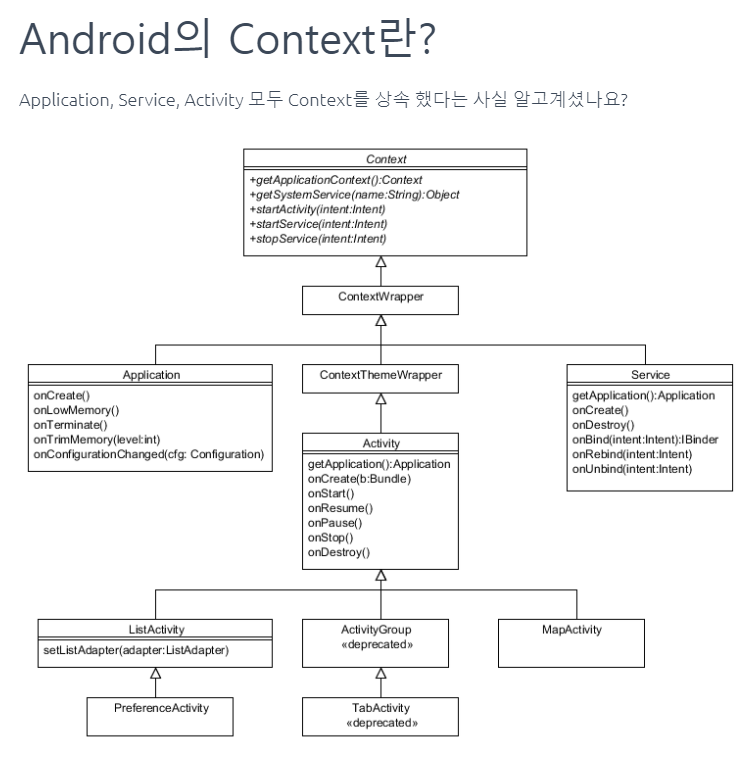

  - Abstract 클래스인 Context의 주요 2가지 역할

    - 1 어플리케이션에 관하여 시스템이 관리하고 있는 정보에 접근하기(GET) 
      - getPackageName(), getResource()
    - 2 안드로이드 시스템 서비스에서 제공하는 API 를 호출 할 수 있는 기능
      - startActivity(), bindService()

  - 필요한 이유 : 안드로이드는 Context라는 인스턴스화된 매개체를 통해 , 시스템 함수를 API를 호출한다.

    - System.~~ 

:purple_heart: Java

- 상속 https://wikidocs.net/280 점프투자바


:green_heart: Vue.js 

- ##### 최신버전 재구성 세팅

- vue-cli 2버전(init)

- ```
  vue-cli 2.9.6 (init)
  
  vue 2.6.10 2버전
  vuetify 1.5.12
  webpack.. 
  ```

- vue-cli 3버전 이상(create)

- ```
  @vue/cli 4.5.10 (create)
  
  vue 2.6.11 2버전
  vuetify 2.4.5
  
  ```

- 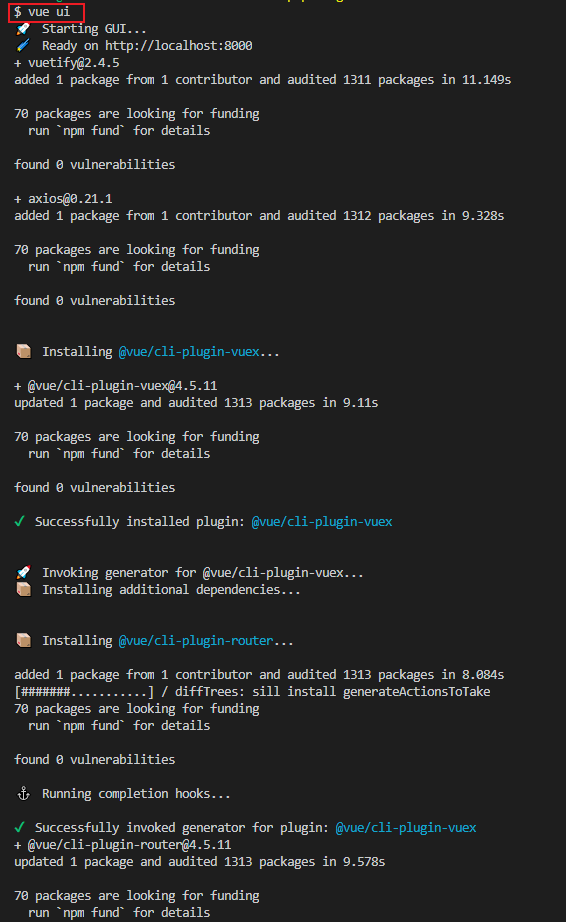

CLI(@vue/cli)는 전역적으로 설치된 npm 패키지, Vue.js 프로젝트를 생성하는 `vue create`, UI를 통해 프로젝트를 관리할 수 있는 `vue ui`

https://kdydesign.github.io/2019/04/22/vue-cli3-tutorial/

```bash
$ vue ui
```

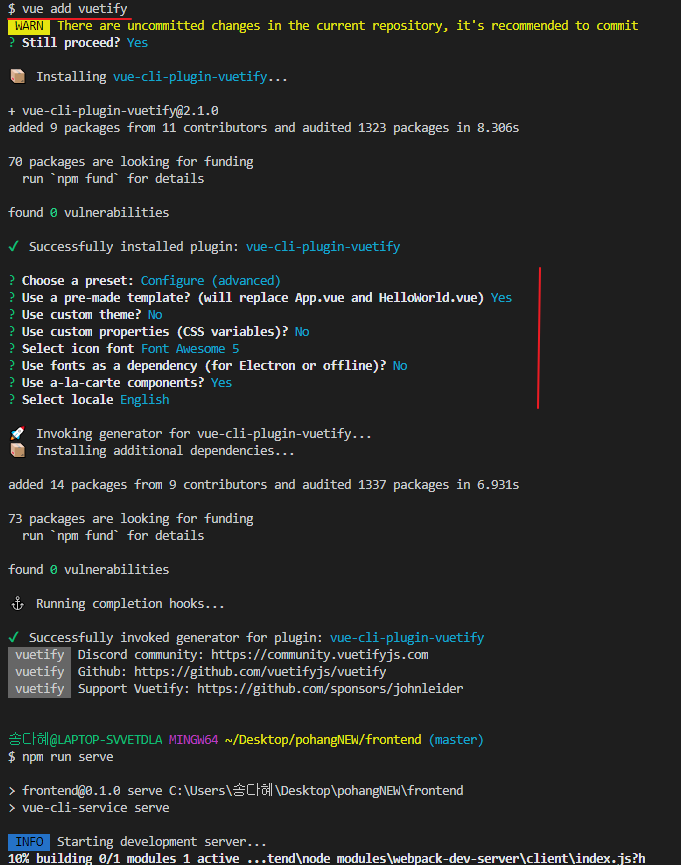


## 02/26(금)

:green_heart: Vuex

>참고
>
>https://simplevue.gitbook.io/intro/01.-vue-cli 입문 :+1:
>

- vue 버전이랑 vue-cli 버전은 다른거다...https://joshua1988.github.io/vue-camp/vue/cli.html

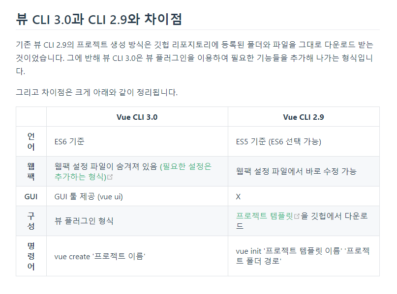

​						- webpack.config.js

- 이슈

현재 뷰티파이는 뷰3 버전에 맞춰 개발 진행 중... (21년도 가을 예정)

https://vuetifyjs.com/en/getting-started/installation/

The current version of Vuetify does not support Vue 3. Support for Vue 3 will come with the release of [Vuetify v3](https://vuetifyjs.com/en/introduction/roadmap/#v30-titan). When creating a new project, please ensure you selected Vue 2 from the Vue CLI prompts, or that you are installing to an existing Vue 2 project.

https://vuetifyjs.com/en/introduction/roadmap/

- Vue3

> 공식한글문서 https://v3.vuejs-korea.org/guide/migration/introduction.html

https://ui.toast.com/weekly-pick/ko_20200804

- vue-cli 4.5.0 기본 vue

```json
{
  "name": "frontend",
  "version": "0.1.0",
  "private": true,
  "scripts": {
    "serve": "vue-cli-service serve",
    "build": "vue-cli-service build",
    "lint": "vue-cli-service lint"
  },
  "dependencies": {
    "core-js": "^3.6.5",
    "vue": "^2.6.11"
  },
  "devDependencies": {
    "@vue/cli-plugin-babel": "~4.5.0",
    "@vue/cli-plugin-eslint": "~4.5.0",
    "@vue/cli-service": "~4.5.0",
    "babel-eslint": "^10.1.0",
    "eslint": "^6.7.2",
    "eslint-plugin-vue": "^6.2.2",
    "vue-template-compiler": "^2.6.11"
  },
  "eslintConfig": {
    "root": true,
    "env": {
      "node": true
    },
    "extends": [
      "plugin:vue/essential",
      "eslint:recommended"
    ],
    "parserOptions": {
      "parser": "babel-eslint"
    },
    "rules": {}
  },
  "browserslist": [
    "> 1%",
    "last 2 versions",
    "not dead"
  ]
}

```

cache clean


## 02/27(토)

:green_heart: Vuex 

cli4로 올리니 cli2 보다 깐깐해 ㅜㅜ

 ```
The "the-header" component has been registered but not used
'oldStatus' is defined but never used
 ```

ESLint https://eslint.org/docs/rules/no-empty


## 02/28(일)

:green_heart: Vuex 

## package.json 

> 참고
>
> https://velog.io/@skyepodium/package.json
>
> https://www.zerocho.com/category/NodeJS/post/5825a3caaff5c70018279975

프로젝트 정보(name, version) / 패키지 버전 정보 명시(dependencies, devDependencies )

- 패키지와 모듈 
  - 패키지 :  package.json 으로 설명되는 파일 또는 디렉토리
  - 모듈 : node.js의 require() 함수로 로드될 수 있는 node_modules 디렉토리안의 파일 또는 디렉토리
  - 모듈이 패키지 보다 조금 더 큰 개념 , package.json을 가진 모듈만이 패키지

- **dependencies**는 일반적인 경우 의존하고 있다는 것을 알려주는 곳, (--save -S)
- **devDependencies**는 개발 모드일 때만 의존하고 있다는 것을 알려주는 곳. (--save-dev -D)
  devDependencies는 실제로 배포할 때는 필요없는 테스트 도구나 웹팩, 바벨같은 것들을 넣어두면 됩니다.
   - 플로그인 / 바벨 / 웹팩 https://poiemaweb.com/es6-babel-webpack-1
   - 트랜스파일러 **바벨** : ES6+ 지원하지 않는 브라우저에서 ES5이하 버전 변환되서 사용
     Babel는 최신 사양의 자바스크립트 코드를 IE나 구형 브라우저에서도 동작하는 ES5 이하의 코드로 변환(트랜스파일링)할 수 있다. / scss > css
   - 모듈번들러 [**웹팩**](https://poiemaweb.com/es6-babel-webpack-2) : 의존 관계에 있는 모듈들을 하나의 자바스크립트 파일로 번들링하는 모듈 번들러 / sass 트랜스파일링 관리
      - node-sass는 node.js 환경에서 사용할 수 있는 Sass 라이브러리이다. 실제로 Sass를 css로 컴파일하는 것은 node-sass
      - style-loader, css-loader, sass-loader는 Webpack 플러그인

- **engines**, **os**, **cpu**는 이 패키지가 특정한 환경에만 동작하도록 하는 속성

- **버전 : "(기호)메이저.마이너.패치"** 
  - 시맨틱 버저닝
  - 메이저는 대규모 업데이트(이전 버전과 호환 안 됨),
    마이너는 소규모 업데이트(이전 버전과 호환은 됨),
    패치는 버그 수정 시에 버전을 올립니다.
  - 기호 : 그냥숫자, 캐럿^(마이너버전까지 변경허용), 틸드~(패치버전까지 변경허용), 부등호(해당부등호와 일치), x 는 어떤 숫자든지 괜찮음, latest 가장 최신 버전


- npm 명령어 https://www.zerocho.com/category/NodeJS/post/58285e4840a6d700184ebd87
  - **npm dedupe**는 npm의 중복된 패키지들을 정리할 때

```
npm install 패키지@버전 옵션(없으면 dependencies 자동/-g 글로벌에 설치되니 조심)
```

- 

---

## regex 정규표현식

> https://github.com/dream-ellie/regex

공부방법, 사용 예제, 유용한 사이트에 대한 정보는 유튜브 영상에서 확인해 보세요 🙌

연습용 사이트: [regexr.com/5mhou](https://regexr.com/5ml92)

### 문법 정리

### Groups and ranges

| Chracter | 뜻                                     |
| -------- | -------------------------------------- |
| `|`      | 또는                                   |
| `()`     | 그룹                                   |
| `[]`     | 문자셋, 괄호안의 어떤 문자든           |
| `[^]`    | 부정 문자셋, 괄호안의 어떤 문가 아닐때 |
| `(?:)`   | 찾지만 기억하지는 않음                 |

### Quantifiers

| Chracter    | 뜻                                  |
| ----------- | ----------------------------------- |
| `?`         | 없거나 있거나 (zero or one)         |
| `*`         | 없거나 있거나 많거나 (zero or more) |
| `+`         | 하나 또는 많이 (one or more)        |
| `{n}`       | n번 반복                            |
| `{min,}`    | 최소                                |
| `{min,max}` | 최소, 그리고 최대                   |

### Boundary-type

| Chracter | 뜻               |
| -------- | ---------------- |
| `\b`     | 단어 경계        |
| `\B`     | 단어 경계가 아님 |
| `^`      | 문장의 시작      |
| `$`      | 문장의 끝        |

### Character classes

| Chracter | 뜻                           |
| -------- | ---------------------------- |
| `\`      | 특수 문자가 아닌 문자        |
| `.`      | 어떤 글자 (줄바꿈 문자 제외) |
| `\d`     | digit 숫자                   |
| `\D`     | digit 숫자 아님              |
| `\w`     | word 문자                    |
| `\W`     | word 문자 아님               |
| `\s`     | space 공백                   |
| `\S`     | space 공백 아님              |