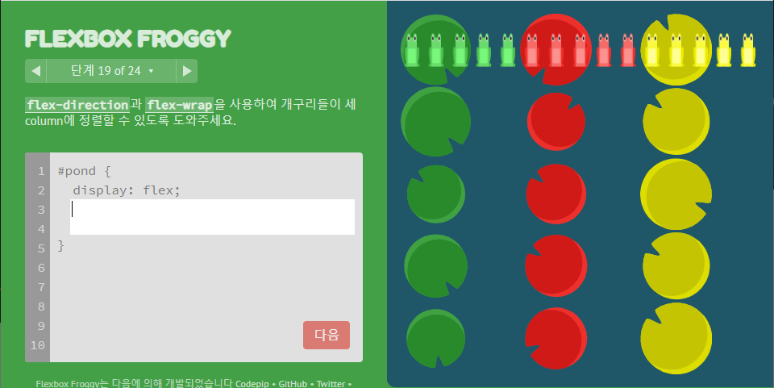

# 3_TIL_Private

:purple_heart: Java

:green_heart: Vue.js

:black_heart: Javascript

:two_hearts: Android 안드로이드

:handshake: PJT업무

:crescent_moon: 달이 조언​

:heart: 개념/용어

:blue_heart: 글/영상

:books: 책/강의


## 03/01(월)

:black_heart: Javascript

> 공식사이트 ecma-international.org
>
> MDN사이트 developer.mozilla.org :star: :thumbsup:
>
> www.w3schools.com

드림코딩 엘리 https://www.youtube.com/watch?v=tJieVCgGzhs

```
바닐라 자바스크립트 스크립트 모드 
'use strict';
```


:green_heart: Vue.js

라이브러리 momentjs 

https://momentjs.com/

```bash
$ npm install --save vue-momentjs

// main.js
import Vue from "vue";
import moment from "moment";
import VueMomentJS from "vue-momentjs";
 
Vue.use(VueMomentJS, moment);
```


## 03/02(화)

03/02(화) ~ 03/05(금)

:handshake: PJT업무

:green_heart: Vue.js

- 뷰티파이 1.5 > 2.x upgrade migration

  > https://vuetifyjs.com/en/getting-started/upgrade-guide
  >
  > https://blog.minamiland.com/569  레이아웃 정리


## 03/05(금)

:black_heart: CSS

### CSS selector

https://poiemaweb.com/css3-selector

셀렉터 { 프로퍼티 : 값; 프로퍼티:값;}

- 자식 - 셀렉터 > 셀렉터
- 후손(자식포함) 띄어쓰기로 이어서사용 - 셀렉터 셀렉터
  - SCSS 에서는 셀렉터 { 셀렉터 {프로퍼티: 값}} 로 표현 가능
- 같은 클래스끼리 있는 것을 묶을 때(&) .class1.class2
- 각자 클래스에 적용할 때(or) .class1, .class2

```css
    /* p 요소의 부모 요소의 자식 요소 중, 첫 p 요소 */
    p:first-of-type  { color: red; }

    /* 첫번째 자식이 P요소일 경우, 첫 p 요소*/
    p:first-child { background: brown;}
```

같은 속성이면 선언된 순서에 따라 덧씌워짐

가상 요소에는 두개의 콜론(::)을 사용

class="text-16px-rem"


## 03/06(토)

:heart: 개념/용어

- i18n : internationalization
- a11y : accessibility 웹접근성


## 03/07(일)

:heart: 개념/용어

- 아이프레임

:green_heart: Vue.js

- v-checkbox의 hide-details (아래 여백 없애줌)
- v-btn의 flat -> text

:black_heart: CSS

- flex 플렉스박스

- https://thomaspark.co/

  - https://flexboxfroggy.com/#ko flex 개구리 게임

  - https://codepip.com/games/grid-garden/#ko grid 가든게임

> 1분코딩 : **CSS Flex와 Grid 제대로 익히기**(20.02.15)
>
> https://studiomeal.com/archives/197 :star2:
>
> https://www.inflearn.com/course/css-flex-grid-%EC%A0%9C%EB%8C%80%EB%A1%9C-%EC%9D%B5%ED%9E%88%EA%B8%B0?inst=86d8c4bb#
>
> https://www.youtube.com/watch?v=eprXmC_j9A4

```

```

### display: flex;

아래의 각 CSS 속성은 다음의 값들을 인자로 받아 컨테이너(class="container") 안에서 요소들이 정렬해야 할 방향을 지정합니다:

- justify-content 가로기준
- align-items / align-self 세로기준
- flex-direction 정렬 가로세로역
- flex-wrap 줄 내리기
- flex-flow = flex-direction + flex-wrap
- align-content 여러 줄 간격
- order

---

- 1 가로상 정렬 **justify-content**: flex-start; (기본값)
  - `flex-start`: 요소들을 컨테이너의 왼쪽으로 정렬합니다.
  - `flex-end`: 요소들을 컨테이너의 오른쪽으로 정렬합니다.
  - `center`: 요소들을 컨테이너의 가운데로 정렬합니다.
  - `space-between`: 요소들 사이에 동일한 간격을 둡니다.(양끝)
  - `space-around`: 요소들 주위에 동일한 간격을 둡니다.

- 2 세로상 정렬 **align-items**: stretch; (default)

  - `stretch`: 요소들을 컨테이너에 맞도록 늘립니다.(기본값)
  - `flex-start`: 요소들을 컨테이너의 꼭대기로 정렬합니다.

  - `flex-end`: 요소들을 컨테이너의 바닥으로 정렬합니다.

  - `center`: 요소들을 컨테이너의 세로선 상의 가운데로 정렬합니다.

  - `baseline`: 요소들을 컨테이너의 시작 위치에 정렬합니다.
  - **`align-self`** 개별 요소에 적용할 수 있는 또 다른 속성입니다. 이 속성은 `align-items`가 사용하는 값들을 인자로 받으며, 그 값들은 지정한 요소에만 적용합니다.

- 정중앙

  - ```css
    display: flex;
    justify-content: center;
    align-items: center;
    ```

- 3 정렬순서 **`flex-direction`**: row; (default)

  - `row`: 요소들을 텍스트의 방향과 동일하게 정렬합니다.

    - ```
      A B C
      ```

  - `row-reverse`: 요소들을 텍스트의 반대 방향으로 정렬합니다.

    - ```
            C B A |(우측끝)
      ```

  - `column`: 요소들을 위에서 아래로 정렬합니다.

    - ```
      A
      B
      c
      
      ```

  - `column-reverse`: 요소들을 아래에서 위로 정렬합니다.

    - ```
      
      c
      B
      A
      ```

  - column-reverse 또는 row-reverse를 사용하면 요소들의 start와 end의 순서도 뒤바뀝니다.
    

  - Flex의 방향이 column일 경우,
     `justify-content`의 방향이 가로->세로로,
     `align-items`의 뱡향이 세로->가로로 바뀝니다.
    

- **order** : 0; (기본값)

  - 음수, 0, 양수
  - 각 요소에 적용가능한 속성 (상대적인듯)

- 4 **`flex-wrap`** 줄 간격 맞추기 (아랫줄로 멀리~내리기) 
  - `nowrap`: 모든 요소들을 한 줄에 정렬합니다. (기본값)
  - `wrap`: 요소들을 여러 줄에 걸쳐 정렬합니다.
  - `wrap-reverse`: 요소들을 여러 줄에 걸쳐 반대로 정렬합니다.

- 5 `flex-flow` = flex-direction + flex-wrap
  이 속성은 공백문자를 이용하여 두 속성의 값들을 인자로 받습니다.
  

  

  

- 6 `align-content` 여러 줄 사이의 간격 지정
  - `stretch`: 여러 줄들을 컨테이너에 맞도록 늘립니다. (기본값)
  - `flex-start`: 여러 줄들을 컨테이너의 꼭대기에 정렬합니다.
  - `flex-end`: 여러 줄들을 컨테이너의 바닥에 정렬합니다.
  - `center`: 여러 줄들을 세로선 상의 가운데에 정렬합니다.
  - `space-between`: 여러 줄들 사이에 동일한 간격을 둡니다.
  - `space-around`: 여러 줄들 주위에 동일한 간격을 둡니다.
  - `align-content`는 여러 줄들 사이의 간격을 지정하며,
     `align-items`는 컨테이너 안에서 어떻게 모든 요소들이 정렬하는지를 지정합니다.
    한 줄만 있는 경우, `align-content`는 효과를 보이지 않습니다.

final 조합


```css
/* 정답 1*/
flex-direction: column-reverse;
flex-wrap: wrap-reverse;
justify-content: center;
align-content: space-between;
```

```css
/* 정답 2*/
flex-flow: column-reverse wrap-reverse;
justify-content: center;
align-content: space-between;
```


삽질


정답


---

- flex: flex-grow flex-shrink flex-basis;

  


## 03/08(월)

:green_heart: Vue.js

- deep selector
  - CSS `>>>`
  - SCSS /deep/ -> ::v-deep
    부모 컴퍼넌트에 있는 엘리먼트 뿐만 아니라 자식 컴퍼넌트에도 동일한 클래스명이 있다면 css 전부 적용
  - [문서](https://vue-loader.vuejs.org/guide/scoped-css.html#deep-selectors) / [번역](https://velog.io/@tjdud0123/Scoped-CSS-deep-selector)
  - [문제](https://forum.vuejs.org/t/deep-selector-not-working/68037)

:black_heart: CSS

- https://d2.naver.com/helloworld/8540176
- https://heropy.blog/2018/11/24/css-flexible-box/

-  display:flex; / display: grid; 
- https://flexboxfroggy.com/#ko flex 개구리 게임
- https://codepip.com/games/grid-garden/#ko grid 가든게임

flexbox와 별개로 CSS 그리드를 설정하면 컬럼과 행 두가지 측면에서 쉽게 그리드 항목을 배치할 수 있습니다.

---

### display: grid; 

- `column` 은 좌우이동 / `row`는 상하이동...

- 1 `grid-column-start`이 단독으로 사용될때는, 한개의 그리드 열(column)
  
  - 숫자 / span 숫자 (넓이)
- 2  `grid-column-end` 속성을 같이 사용하면 여러 열(column)에 걸쳐 확장이 가능
  
- 숫자 / span 숫자 (넓이)
  
- 같이 쓰면 마지막은 미포함 (이상 =< 범위 < 미만)

- 왼쪽이 기준이면 양수, 오른쪽이 기준이면 음수

  ```
   0 0 0 0 0
  -6-5-4-3-2
  +1+2+3+4+5
  ```

- 3 `grid-column` : <`grid-column-start`> / <`grid-column-end`> ;

- 4 `grid-area` :  `grid-row-start` / `grid-column-start`/ `grid-row-end`/ `grid-column-end` - |=|
- order
  - table 레이아웃에 비해 grid 시스템의 장점인 `order` 속성을 이용
  - 기본적으로, 그리드의 모든 요소들은 `order`의 값이 0이지만, `z-index`와 같이 양수와 음수의 값 모두 설정이 가능

...

## 03/09(화)

:black_heart: CSS

- grid

- https://developer.mozilla.org/ko/docs/Web/CSS/CSS_Grid_Layout/Basic_concepts_of_grid_layout

-  `fr` (fractional)단위들은 사용가능한 공간을 하나로 공유하여 할당합니다.
  예시로, 두개의 element들을 `1fr`과 `3fr`로 설정시, 공간이 4개의 동일한 크기로 공유됩니다. 
  첫 번째 element는 사용가능한 공간의 1/4 크기로 그리고 두 번째 element는 3/4 크기를 차지합니다.

- 5 `grid-template` : <`grid-template-rows`> / <`grid-template-columns`>


## 03/10(수) :star:

:black_heart: CSS

- CSS selector
  - .a-class .b-class  {} // 후손 모두 
  - .a-class > .b-class  {} // 자식만
  - .a-class + .b-class  {} // 형제


## 03/11(목)

:black_heart: CSS

-  `gutter` 거터 (그리드 간의 간격)

  > CSS grid 정리 : https://yamoo9.gitbook.io/css-grid/css-grid-guide/grid-gutter :star2:

  - vuetify2  v-row 의 no-gutters 옵션은 v-col 사이 gutter를(패딩 값옵션...) 없애주기 위한 것 ㅜㅜ


## 03/12(금)

:books: 인프런 **모든 개발자를 위한 HTTP 웹 기본 지식**

- IP(인터넷 프로토콜) / TCP
- URI


## 03/13(토)

:books: :black_heart: JS 헤드퍼스트 자바스크립트 프로그래밍 (2015)

> p~ 80 ch.1 기본형


## 03/14(일)

:books: :black_heart: JS 헤드퍼스트 자바스크립트 프로그래밍 (2015)

> p123~162 ch.3 함수


## 03/15(월)

:books: :black_heart: JS 헤드퍼스트 자바스크립트 프로그래밍 (2015)

> p163~192 ch.4 배열


## 03/16(화)

:books: :black_heart: JS 헤드퍼스트 자바스크립트 프로그래밍 (2015)

> p190~210 ch.4 배열


- 소스트리(깃 관리툴)
  - 제거(Remove)는 완전히 그 파일을 삭제한다는 것이고

  - 폐기(Discard)는 내가 **변경한 내용을 제거하고 원래 커밋되어있던 내용으로** 돌려주는것이다.

    >  https://haru.kafra.kr/21 [어제도 오늘도 내일도 언제나 하루]

- 커밋 前 시나리오

  - 일단 pull
    - 충돌없음 > 커밋&푸시 > 끝
    - 충돌있음
      - 1) 폐기 > pull
      - 2) 커밋 > pull > 충돌 > 해결 > 커밋&푸시
      - 3) 브랜치에 커밋 > 머지(충돌>해결>머지) > 푸시
      - 4) 다른 별도의 곳에 옮기기

- ```
  pull = fetch + merge
  ```

- package-lock.json

  > https://medium.com/@han7096/package-lock-json-%EC%97%90-%EA%B4%80%ED%95%98%EC%97%AC-5652f90b734c
  >
  > https://junwoo45.github.io/2019-10-02-package-lock/
  - 동일한`package.json`파일로 `npm i`을 실행 해도 다른 버전 설치 가능성있음
  - package.json 파일과 package-lock.json 파일을 같이 커밋해야 pull 받고 npm install 했을때 동일한 환경에서 작업 가능


## 03/17(수)

:books: :black_heart: JS 헤드퍼스트 자바스크립트 프로그래밍 (2015)

> p... ch.5 객체

- SCSS = SASS + CSS
  - 순수 사스(;이 없음)로만 하지는 않고, SCSS확장자로 구현하는데, 그냥 `사스`로 했다라고 말한다. SCSS는 CSS와 호환이 잘 된다.
  - 정적인 CSS를 동적으로 사용하려고(변수, 함수..) SCSS를 쓴다.
  - 그렇지만 동적으로 쓰려면 JS를 활용하는데, 무언가는 동적인 CSS가 필요할 때가 있는 법... 변수나 반복문 사용할 땐 편리

### CSS속성 : vw, vh, vmin, vmax, em, rem

> https://nykim.work/85 나나 웹퍼블리셔

1vw = 뷰포트 너비의 1%

1vh = 뷰포트 높이의 1%


## 03/22(월)

vuex  핵심

```vue
export default new Vuex.Store({
    state: {}, // data
    getters: {}, //computed
    mutations: {}, //methods(data조작) //commit으로 실행
    actions: {}, //methods dispatch으로 실행
    modules:{},
})
```

Form submission canceled because the form is not connected

- Form submit


## 03/23(화)

- 반복문 사용시 변수명 설정


## 03/24(수)

:purple_heart: Java

@SuppressWarnings : 강제형변환같은 코드상 노란 밑줄 없애기

`@SuppressWarnings("unchecked");`

**all** : 모든 경고를 표시 안함

**cast** : 캐스트 연산자 관련 경고를 표시 안함

**dep-ann** : 사용하지 말아야 할 주석 관련 경고를 표시 안함

**deprecation** : 사용하지 말아야 할 메소드 관련 경고를 표시 안함

**fallthrough** : switch문에서의 break 누락 관련 경고를 표시 안함

**finally** : 반환하지 않는 finally 블럭 관련 경고를 표시 안함

**null** : null 분석 관련 경고를 표시 안함

**rawtypes** : 제네릭을 사용하는 클래스 매개 변수가 불특정일 때의 경고를 표시 안함

**unchecked** : 검증되지 않은 연산자 관련 경고를 표시 안함

**unused** : 사용하지 않는 코드 관련 경고를 표시 안함

출처: https://yangyag.tistory.com/152 [Hello Brother!]


- jwt 토큰인증 필요 여부 `filter`(웹요청을 controller에 보내기 전에 점검)
  

## 03/25(목)

:books: :black_heart: Do it! 웹 프로그래밍을 위한 자바스크립트 기본편

qr 라이브러리 조사

https://github.com/zxing-js/library

https://zxing-js.github.io/library/examples/qr-svg-writer/


## 03/26(금)

QR코드 설문지 api연결 (결과 저장 생성post)

- qr 라이브러리 적용
  
- qucode.vue
  
- base64 :  복호화 가능(원문으로 돌리기 가능)

  - 인코더 https://www.base64encode.org/

  - 디코더 https://www.base64decode.org/

  - 인코딩 = 어떠한 다른 형태로 변환하는 것
    디코딩 = 원래 상태로 돌리는. 것

    암호화 / 복호화와 비슷 하지만 기본적으로 별도의 암호키가 존재하지 않는한 그건 암호로 보지 않기 때문에 base64는 인코딩/디코딩에 가까움

- 해싱 : 원문으로 되돌리기 불가능
- 암호화

- Marquee (위조방지 문구움직이기) 라이브러리
  - https://evodiaaut.github.io/vue-marquee-text-component/?ref=madewithvuejs.com
  - https://github.com/EvodiaAut/vue-marquee-text-component


## 03/27(토)

- SASS
- vscode 확장 : Git Lens(소스가 누구의 깃인지 확인), Git Graph(GUI)


