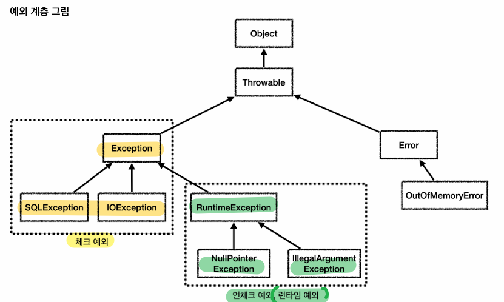

# 5_TIL_Private

:purple_heart: Java

:green_heart: Python

:black_heart: 인프라

:handshake: PJT업무

:crescent_moon: 달이 조언​

:heart: 개념/용어

:blue_heart: 글/영상

:books: 책/강의

---

## 5/1(목)
:purple_heart: Java Review

package java.lang (당연해서 import 생략가능)
- 묵시적(Implicit) vs 명시적(Explicit)
    - 묵시적 : 자동으로 함
    - 명시적 : 말해줘야 함

> Object 클래스
- Object 클래스 : 최상위 부모클래스
    - 모든 객체에 필요한 공통 기능 제공, 다형성의 기본구현
        - toString(), equals(), getClass()...
        ```java
        public String toString() {
            return getClass().getName() + "@" + Integer.toHexString(hashCode());
        }
        ```
- 객체의 정보 알아보기 : 참조값 출력
    ```java
    # 1
    # 2 
    # 3
    String ref = Integer.toHexString(System.identityHashCode(dog));
    System.out.println(ref);
    ```

- System.out.println(객체);
해당 객체의 toString() 메서드가 호출됩니다.

1. 만약 toString()을 오버라이드하지 않았다면?
기본적으로 Object 클래스의 toString()이 호출됩니다.

    이때 결과는:
    클래스이름@해시코드(16진수)
    예: lang.wrapper.MyInteger@2f4d3709

2. toString()을 오버라이드했다면?
만약 객체 클래스에서 toString()을 오버라이드했다면,
System.out.println(객체)는 오버라이드된 내용을 출력

## 5/4(일)
:purple_heart: Java Review
> Object 객체의 대표메서드 : toString(), equals()
- toString() : 객체의 문자열 정보
    - println() - 내부에서 toString() 호출하기
    - toString() 오버라이딩해서 사용하기

- 같다
    - 동일성(Identity) : 물리적, `==`연산자, 참조가 동일한 객체를 가르키는지, 완전히 같음
    - 동등성(Equality) : 논리적, `equals()`메서드, 두 객체의 내용물이 같은지, 같은 가치와 수준 의미(형태나 외관이 완전히 같지 않음)

> 불변 객체
- 자바 데이터 타입
    - 기본형(Primitive Type) : 공유X
    - 참조형(Reference Type) : 공유O

- 가변(Mutable) 객체 vs 불변(Immutable) 객체
    - 가변 객체
    - 불변 객체 : `final` 값을 변경할 수 없게 함
        - 주의 ) 불변 객체에서 변경과 관련된 메서드들은
            - 보통 객체를 새로 만들어서(new) 반환하기 때문에 , 꼭 `반환값`을 받아야한다.
            - `with` 시작하는 명칭을 쓴다. 
                "coffee with sugar"
        - 예 )  String, Integer, LocalDate 등 클래스
        - 이유 ) 캐시 안정성, 멀티 쓰레드 안정성, 엔티티의 값 타입

## 5/5(월)
:purple_heart: Java Review
> String 클래스

- 비교
    - 문자열 비교는 `equals()`메서드 사용 ☆
    - 동일성(Identity) : 물리적, `==`연산자 / 사용 X
        - " " 문자열 리터럴 일 때, `문자열 풀 Pool` 사용으로 같게 됨
    - 동등성(Equality) : 논리적, `equals()`메서드 / 사용 O
        - " ", new String(" ") 둘 다 같게 됨
        - 안에 내용물이 같은지가 중요함
* Pool
    - 풀 : 공용 자원 모아둔 곳
    - 문자열 풀은 힙 영역을 사용
    - 문자열 풀에서 문자를 찾을 때 `해시 알고리즘`을 사용하기 때문에 매우 빠른 속도

- String 클래스 특징
    - 불변객체
        - str2 = str1.concat("")
        변경이 필요한 경우 기존 값을 변경하지 않고, 
        대신에 새로운 결과를 만들어서 반환한다

* String (불변) vs StringBuilder (가변)

- StringBuilder - 가변 String
    - 성능 최적화 : 새로운 객체를 만들지 않음 
    - 삽삭갱뒤집기 append(), insert(), delete(), reverse() 등
    - toString 메소드를 사용해 StringBuilder의 결과를 기반으로 String을 생성해서 반환
        - 메서드 체인닝 - Method Chaining
            - ex. StringBuilder().append().append()....toString()
        - 메서드 호출 결과 =  인스턴스 자기 자신의 참조값(주소)을 반환 return this
    - 직접 StringBuilder 쓸 때 (최적화)
        - 반복문에서 반복해서 문자를 연결할 때
        - 조건문을 통해 동적으로 문자열을 조합할 때
        - 복잡한 문자열의 특정 부분을 변경해야 할 때
        - 매우 긴 대용량 문자열을 다룰 때

* StringBuilder vs StringBuffer
    - StringBuilder : 빠름
    - StringBuffer : 느림, 멀티스레드에서 안전
        - list의 Vector

> 래퍼(Wrapper) 클래스 : 기본형의 객체 버전
- 기본형 vs 래퍼클래스
    - 기본형(Primitive Type)은 데이터조각임 : 객체 아님. 메서드 없음. null값 없음
    - 특정 기본형을 감싸서(Wrap) 만든 클래스를 래퍼 클래스 : 객체임

        | 기본형 (Primitive Type) | 래퍼 클래스 (Wrapper Class) |
        | -------------------- | ---------------------- |
        | `byte`               | `Byte`                 |
        | `short`              | `Short`                |
        | `int`                | `Integer`              |
        | `long`               | `Long`                 |
        | `float`              | `Float`                |
        | `double`             | `Double`               |
        | `char`               | `Character`            |
        | `boolean`            | `Boolean`              |

        - 자바는 기본형에 대응하는 래퍼 클래스를 기본으로 제공
        - 기본 래퍼 클래스 특징 : 불변, `equals()` 로 비교해야 한다.

## 5/6(화)
:purple_heart: Java Review
> Eunm 열거 (enumeration)
- 비교 : `==` 사용 
    - `equals()` 비추

* 타입 안전 열거형 패턴 (Type-Safe Enum Pattern)
    ```java
    public class ClassGrade {
        public static final ClassGrade BASIC = new ClassGrade();
        public static final ClassGrade GOLD = new ClassGrade();
        public static final ClassGrade DIAMOND = new ClassGrade();
        //private 생성자 추가 : new 인스턴스 외부 생성 불가
        private ClassGrade() {}
    }
    ```
* 열거형(Enum Type)
    ```java
    public enum Grade {
        BASIC, GOLD, DIAMOND
    }
     ```
    ```java
    import java.lang.Enum

    public class Grade extends Eunm{
        public static final Grade BASIC = new Grade();
        public static final Grade GOLD = new Grade();
        public static final Grade DIAMOND = new Grade();
        //private 생성자 추가
        private Grade() {}
    }
    ```
- 장점
    - 데이터 일관성 및 타입 안정성 : 정해진 값만 사용
    - 확장성 : EUNM 새로운 상수 추가
    - 간결성 : `static import` ?
    - switch문 사용가능 ?

## 5/7(수)
:purple_heart: Java Review
> 날짜와 시간

## 5/8(목)
:purple_heart: Java Review
> 중첩(Nested)클래스, 내부(Inner)클래스

**중첩(Nested)클래스** : 클래스 **안**의 클래스가 있는 것

중첩 클래스는 총 4가지, 크게 2가지로 분류
- 1) 정적 중첩 클래스① 
- 2) 내부 클래스
    - 종류
        - ② 내부 클래스 : -
        - ③ 지역 클래스 : 함수 안 위치
        - ④ 익명 클래스 : 함수 안 위치, 이름없음

| 구분             | static 여부 | 바깥 클래스에 소속 여부 | 비유 표현              |
|------------------|-------------|---------------------------|------------------------|
| 정적 중첩 클래스 | 있음 (O)    | 소속 안 됨 (X)            | 내 안의 다른 것        |
| 내부 클래스      | 없음 (X)    | 소속 됨 (O)               | 내 안의 나             |


※ 실무에서는, `중첩 = 내부` 같이 말함

## 5/14(수)
:purple_heart: Java Review

인스턴스 생성 : new `바깥 클래스.중첩클래스`()
클래스 이름(getClass()) : 바깥 클래스$중첩클래스

중첩클래스는, 같은 클래스에 있으니 
- 캡슐화 가능
- `static` 정적 중첩 클래스의 활용하면 
    - 바깥 클래스의 인스턴스 멤버 접근 불가 [X] 
    - 바깥 클래스의 클래스 멤버(static)에는 접근 가능[O] 
        - `private` 접근 제어자에 접근 가능.
    ```java
        NestedOuter outer = new NestedOuter();
        NestedOuter.Nested nested = new NestedOuter.Nested();
    ```
- 내부 클래스의 활용하면 
    - 바깥 클래스의 인스턴스 멤버 접근 가능[O] 
        - `private` 접근 제어자에 접근 가능.
    - 바깥 클래스의 클래스 멤버(static)에는 접근 가능[O] 
        - `private` 접근 제어자에 접근 가능.
    - **소속**된다 : 바깥클래스의 인스턴스 멤버에는 접근할 수 있으므로, 관련되서 생성해야 함
    
    ```java
        InnerOuter outer = new InnerOuter();
        InnerOuter.Inner inner = outer.new Inner();
        // - 바깥클래스의 인스턴스 참조.new 내부클래스() 로 생성
        // InnerOuter.Inner inner = new InnerOuter.Inner(); // 컴파일오류
    ```
## 5/15(목)
:black_heart: AWS Summit 2025 Seoul

## 5/17(토)
:purple_heart: Java Review
> 예외처리




체크예외 : 컴파일러 체크, 명시적 처리 필요
언체크예외 (런타임 예외) : 명시적 처리 불필요

주의) Error 시스템 예외는 잡지 않기. Throwable 잡지 않기

예외는 폭탄 돌리기 
- 예외가 발생하면 잡아서 처리하거나, catch
- 처리할 수 없으면 (위)밖으로 던져야한다. throws

## 5/18(일)
:purple_heart: Java Review

> 중첩(Nested)클래스, 내부(Inner)클래스